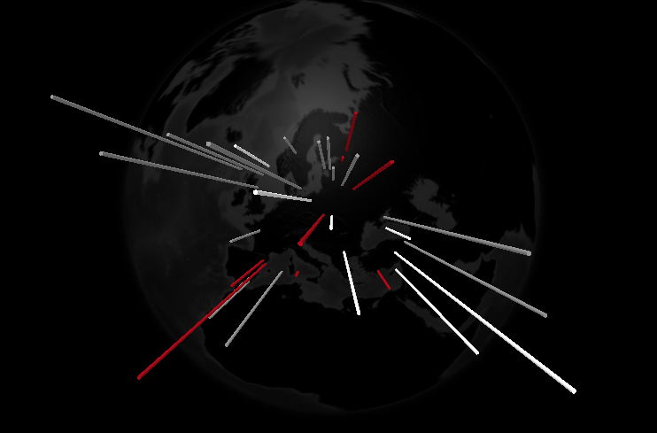

# three-globe proof of concept

Experiments with the [three-globe](https://github.com/vasturiano/three-globe) library to display data on a globe using three.js.



## Usage

This project uses [ParcelJS](https://parceljs.org) to build and package and is easy to launch.

```
npm install
npm start
```
